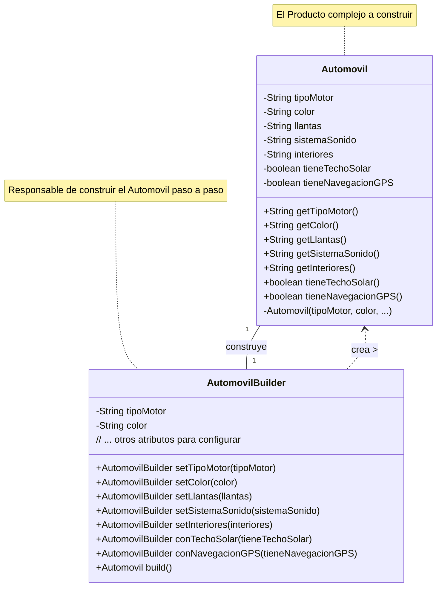

# Escenario 1 - Construccion de Automoviles

## Tipo de patron
Creacional
## Patron
Builder
## Diagrama de clase:


## Implementacion:

### Entidad Automovil

```java
public class Automovil {
    private String tipoMotor;
    private String color;
    private String llantas;
    private String sistemaSonido;
    private String interiores;
    private boolean tieneTechoSolar;
    private boolean tieneNavegacionGPS;

    private Automovil(String tipoMotor, String color, String llantas, String sistemaSonido,
                      String interiores, boolean tieneTechoSolar, boolean tieneNavegacionGPS) {

        this.tipoMotor = tipoMotor;
        this.color = color;
        this.llantas = llantas;
        this.sistemaSonido = sistemaSonido;
        this.interiores = interiores;
        this.tieneTechoSolar = tieneTechoSolar;
        this.tieneNavegacionGPS = tieneNavegacionGPS;
    }

    // Getters
    public String getTipoMotor() { return tipoMotor; }
    public String getColor() { return color; }
    public String getLlantas() { return llantas; }
    public String getSistemaSonido() { return sistemaSonado; }
    public String getInteriores() { return interiores; }
    public boolean tieneTechoSolar() { return tieneTechoSolar; }
    public boolean tieneNavegacionGPS() { return tieneNavegacionGPS; }

    @Override
    public String toString() {
        return "Automovil [Motor=" + tipoMotor + ", Color=" + color + ", Llantas=" + llantas +
               ", Sonido=" + sistemaSonido + ", Interiores=" + interiores +
               ", TechoSolar=" + tieneTechoSolar + ", GPS=" + tieneNavegacionGPS + "]";
    }
```

### Implementacion del builder
```java
    public static class AutomovilBuilder {
        private String tipoMotor = "Estándar"; // Valores por defecto
        private String color = "Blanco";
        private String llantas = "Básicas";
        private String sistemaSonido = "Estándar";
        private String interiores = "Tela";
        private boolean tieneTechoSolar = false;
        private boolean tieneNavegacionGPS = false;

        public AutomovilBuilder setTipoMotor(String tipoMotor) {
            this.tipoMotor = tipoMotor;
            return this;
        }

        public AutomovilBuilder setColor(String color) {
            this.color = color;
            return this;
        }

        public AutomovilBuilder setLlantas(String llantas) {
            this.llantas = llantas;
            return this;
        }

        public AutomovilBuilder setSistemaSonido(String sistemaSonido) {
            this.sistemaSonido = sistemaSonido;
            return this;
        }

        public AutomovilBuilder setInteriores(String interiores) {
            this.interiores = interiores;
            return this;
        }

        public AutomovilBuilder conTechoSolar(boolean tieneTechoSolar) {
            this.tieneTechoSolar = tieneTechoSolar;
            return this;
        }

        public AutomovilBuilder conNavegacionGPS(boolean tieneNavegacionGPS) {
            this.tieneNavegacionGPS = tieneNavegacionGPS;
            return this;
        }

        // Método final para construir el objeto Automovil
        public Automovil build() {
            return new Automovil(tipoMotor, color, llantas, sistemaSonido,
                                 interiores, tieneTechoSolar, tieneNavegacionGPS);
        }
    }
}
```

### Uso
```java
public class Main {
    public static void main(String[] args) {
        // Construir un automóvil con configuraciones específicas
        Automovil automovil = new Automovil.AutomovilBuilder()
            .setTipoMotor("V8")
            .setColor("Negro")
            .setLlantas("Bajo perfil 20 pulgadas")
            .setSistemaSonido("Premium Bose")
            .setInteriores("Cuero beige")
            .conTechoSolar(true)
            .conNavegacionGPS(true)
            .build();

        System.out.println("Coche: " + automovil);

        // Construir un automóvil básico con solo algunas opciones
        Automovil cocheEconomico = new Automovil.AutomovilBuilder()
            .setColor("Azul Celeste")
            .conNavegacionGPS(true) 
            .build(); // demas atributos por defecto

        System.out.println("Coche Económico: " + cocheEconomico);
    }
}
```

## Notas
- El constructor de `Automovil` es privado
- El `Builder` devuelve `this` para encadenamiento

# Escenario 2 - Notificaciones

## Tipo de patrón
Estructural
## Patrón
Bridge

## Diagrama de clases

## Implementación

### Entidades
```java
public class Notificacion {
    private ITipo _tipo;
    private IPlataforma _plataforma;

    public Notification(ITipo tipo, IPlataforma plataforma){
        this._tipo = tipo;
        this._plataforma = plataforma
    }

    public void Mostrar(String mensaje, ...){

    }
}

public interface ITipo  {

}

public class Alerta implements ITipo  {
    ...
}

public class Advertencia implements ITipo  {
    ...
}

public interface IPlataforma {
    void Mostrar(String mensaje, ...);
}


public class Escritorio implements IPlataforma {
    void Mostrar(String mensaje, ...){
        ...
    }
}

public class Web implements IPlataforma {
    void Mostrar(String mensaje, ...){
        ...
    }
}

```
### Implementacion del bridge
```java

```
### Uso
```java

```